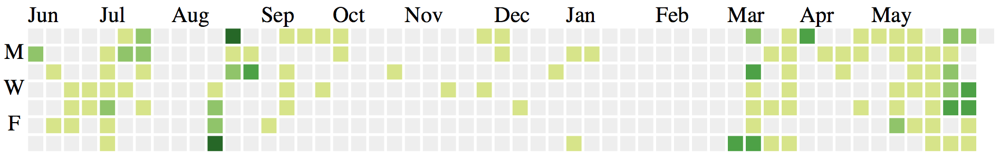

#Node scrape html elements and save to server

- This code fetches the gitHub activity at github.com/stahlmanDesign and saves the markup in `output.json`
- Using this tutorial: https://scotch.io/tutorials/scraping-the-web-with-node-js

## Quick start
- `npm install`
- `node server.js`
- `open http://localhost:8081/scrape`

## Scrapes SVG file by class name and saves as string

- parses it into html string and saves into a JSON file
- this allows it to be loaded and parsed into an SVG
	- parsing and adding to DOM this way allow elements to be styled
	- if just scrape and save the SVG as an .svg file (``), you can't style the elements
	

